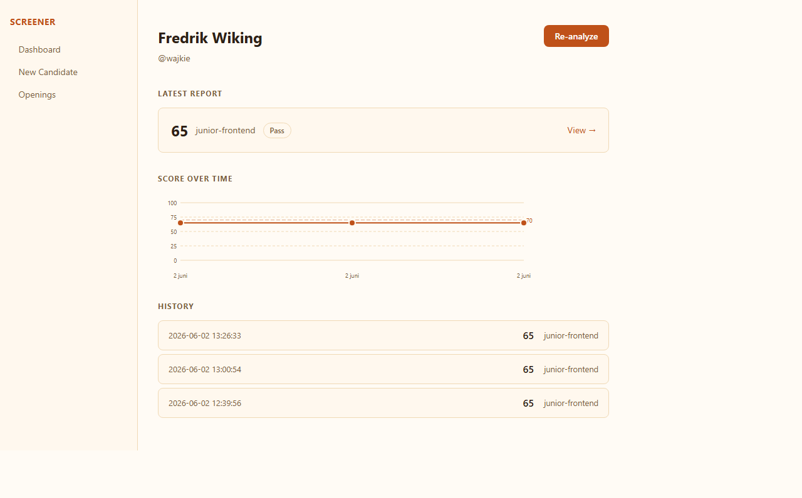
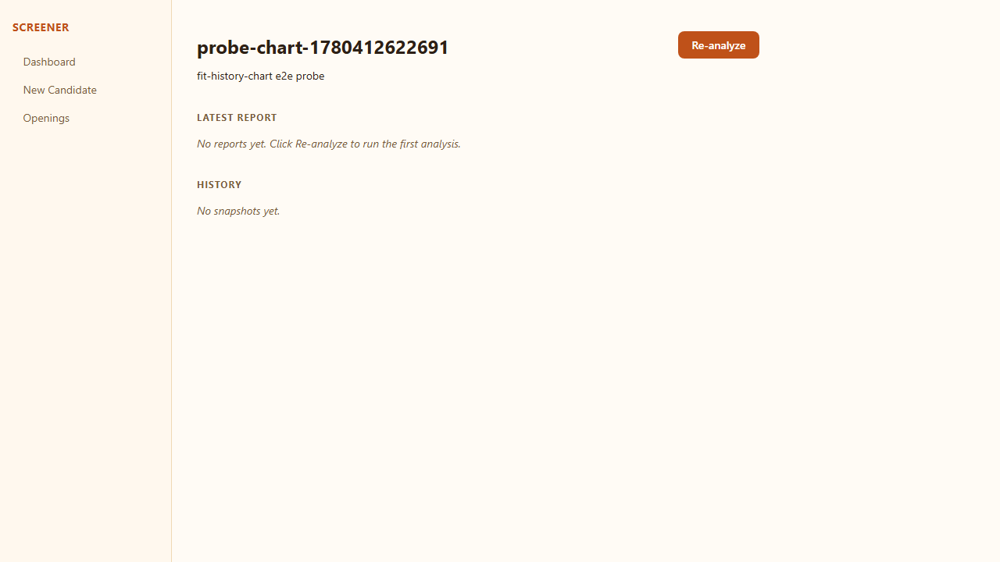

# Fit History Chart

**Verdict:** PASS

**Run:** 2026-06-02T15:03:43.242Z

## Steps

### ✅ Find existing candidate with >= 2 reports

### ✅ GET /candidates/:id/fit-history returns >= 2 ordered entries

### ✅ Candidate detail page shows "Score over time" section

### ✅ SVG chart renders polyline and >= 2 dots

### ✅ Chart section is absent for a candidate with 0 reports (probe)

