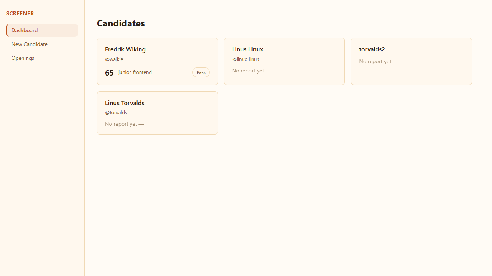
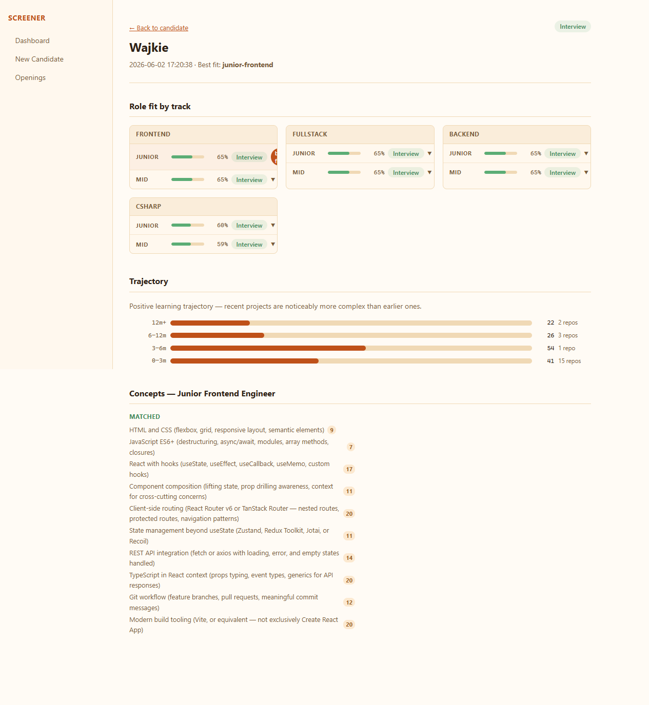
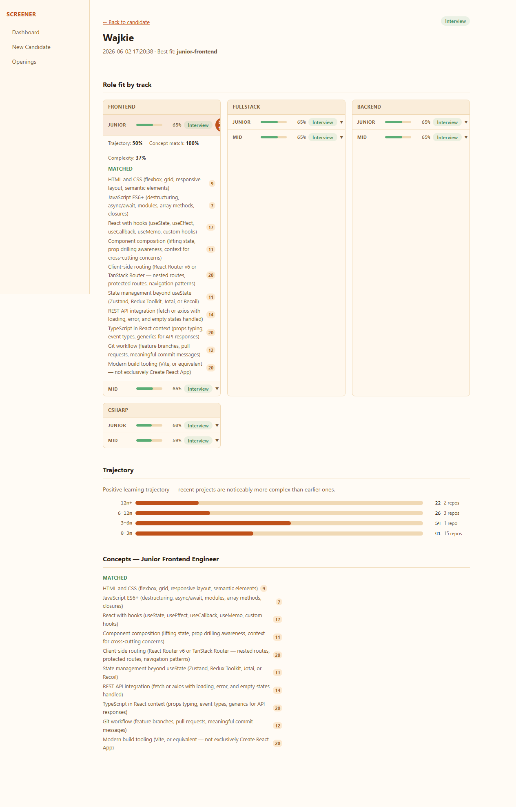
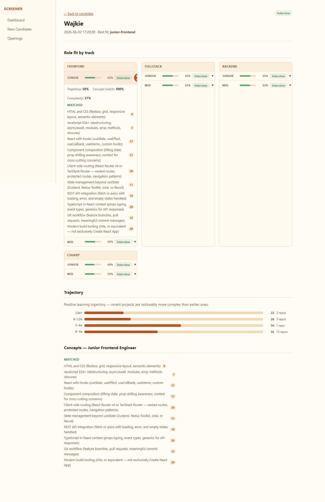
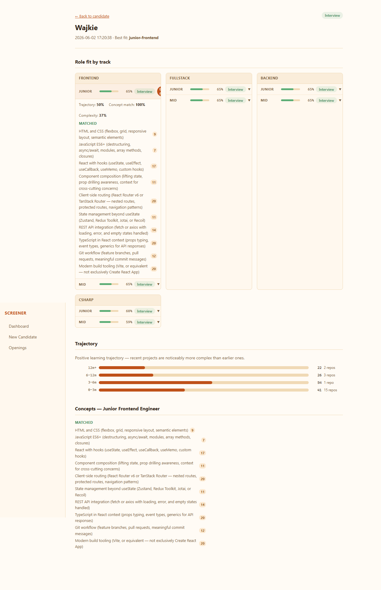

# Issue #22 — Concept occurrence counts in UI and API

**Verdict:** PASS

**Run:** 2026-06-02T15:20:43.439Z

## Steps

### ✅ API is reachable and returns candidate list

### ✅ Create candidate and trigger analysis

### ✅ Report was created with new concept shape (occurrences as objects)

### ✅ Report detail page loads and shows matched concepts section

### ✅ Occurrence badges are visible on matched concepts (best-fit section)

### ✅ Occurrence badge values are positive integers

### ✅ Best-fit concepts section at bottom also shows occurrence badges

### ✅ 🔍 At least one concept has occurrences > 1 (multi-repo signal)

