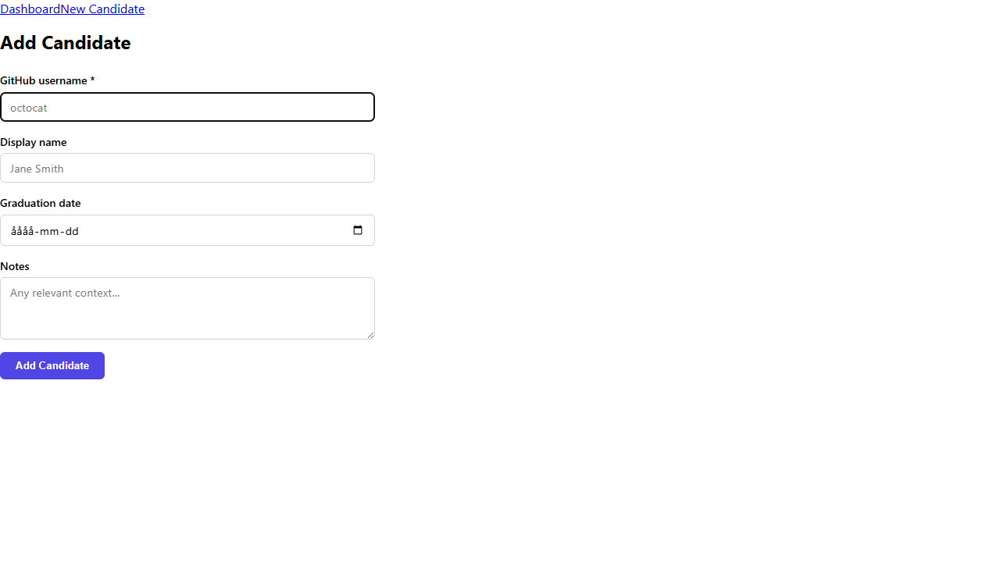
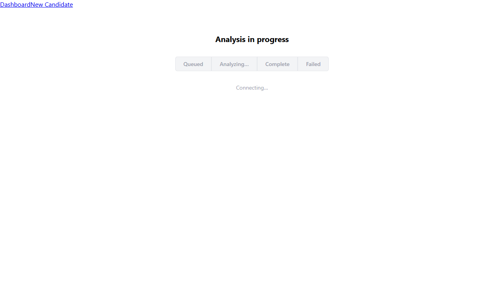
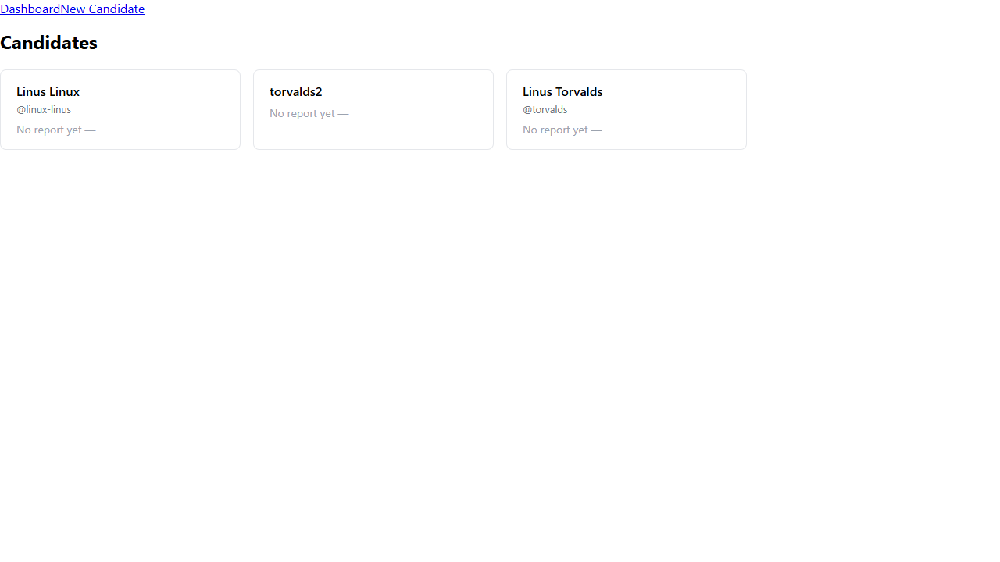

# Issue #29 — screener-ui frontend scaffold

**Verdict:** PASS

**Run:** 2026-06-02T10:22:43.223Z

## Steps

### ✅ npm run dev starts and serves the app (dev server responds)

### ✅ Layout renders nav with links

### ✅ Route / renders (Dashboard placeholder or actual content)

### ✅ Route /candidates/new renders (form or placeholder)

### ✅ Route /candidates/:id renders (detail or placeholder)

### ✅ Route /candidates/:id/jobs/:jobId renders (job status or placeholder)

### ✅ Route /candidates/:id/reports/:reportId renders (report detail or placeholder)

### ✅ Route /roles/:role renders (leaderboard placeholder)

### ✅ Unknown route shows Not Found (no crash)

### ✅ QueryClientProvider wired — TanStack Query is available (no "No QueryClient" error)

### ✅ 🔍 No unhandled JS errors occurred during navigation

