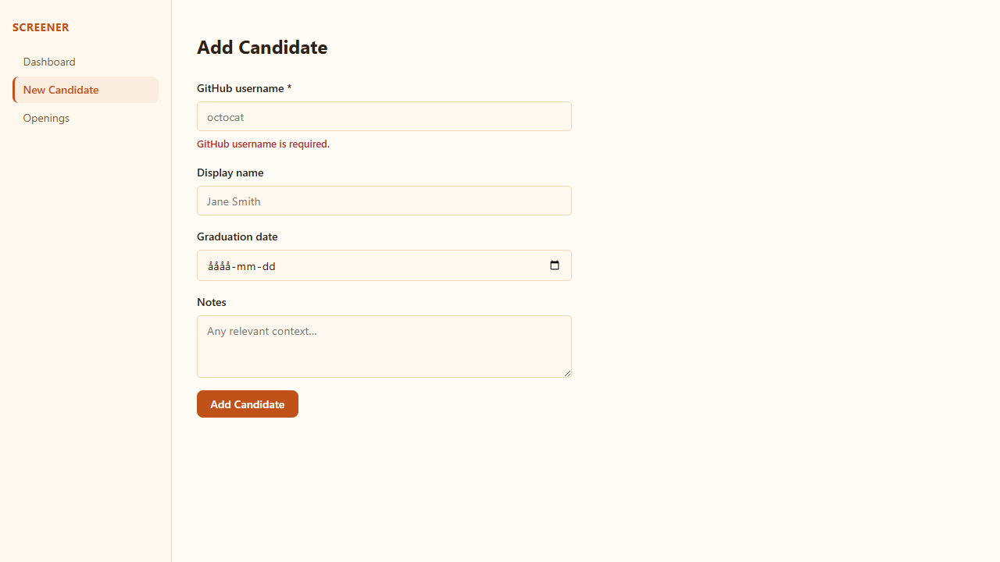
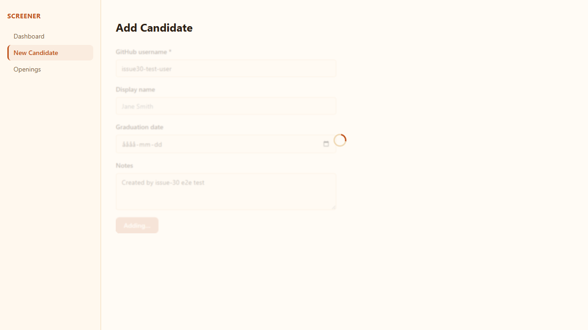
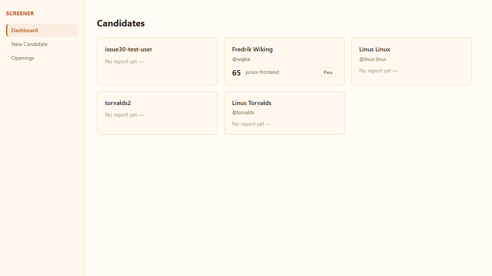
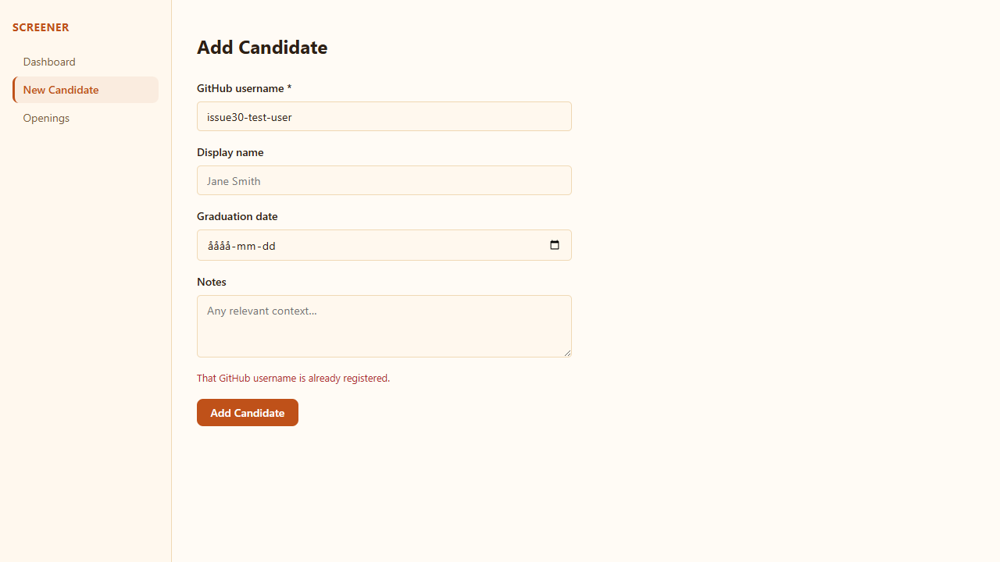

# Issue #30 — Dashboard and create candidate flow

**Verdict:** PASS

**Run:** 2026-06-02T15:37:36.504Z

## Steps

### ✅ / fetches and renders candidate cards; empty state shown when list is empty

### ✅ /candidates/new validates that github_username is non-empty before submitting

### ✅ Successful create redirects to /candidates/:id

### ✅ Each card shows username, latest fit_score (or — placeholder), and recommendation badge

### ✅ Dashboard query is invalidated and refetches after a successful create

### ✅ Duplicate username (409) shows a user-facing error message

### ✅ 🔍 Create form optional fields (display name, graduation date) are present

### ✅ 🔍 Candidate card links to /candidates/:id

