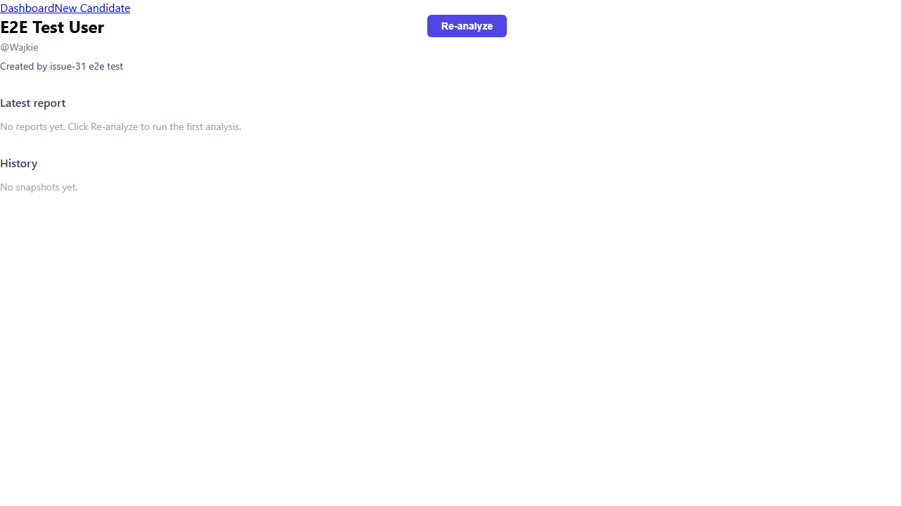
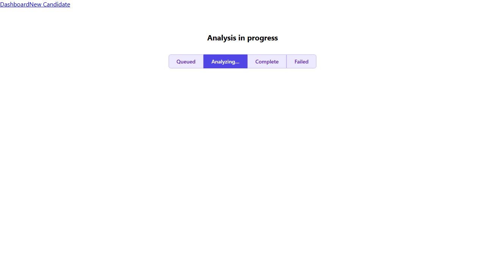
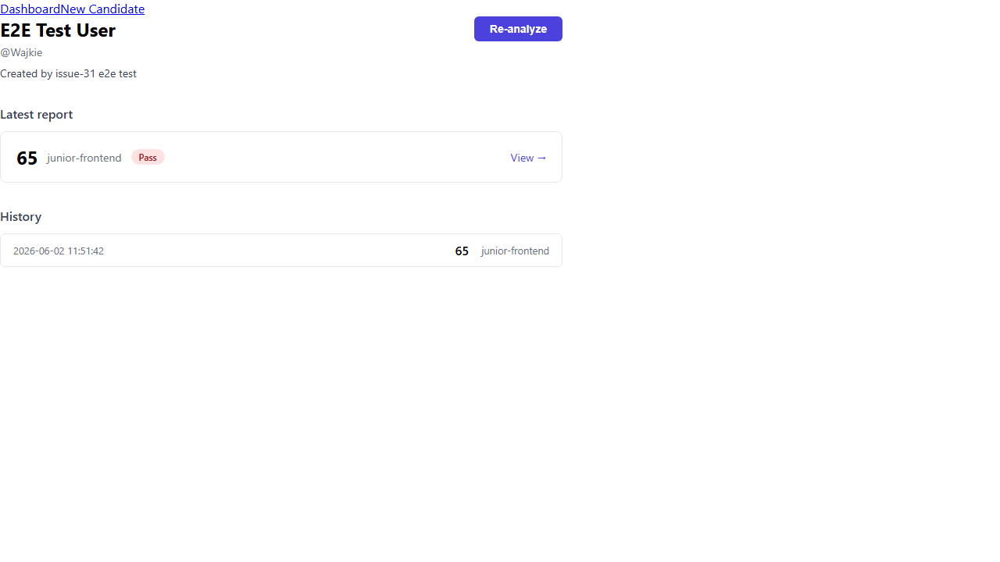
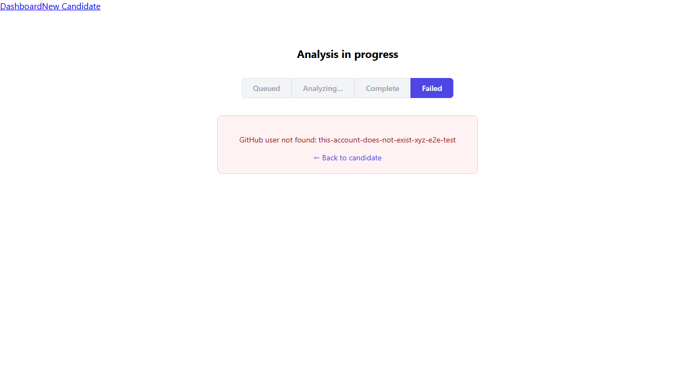
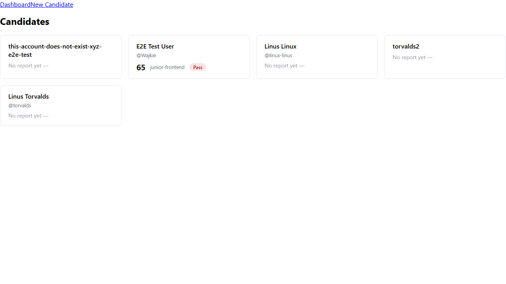

# Issue #31 — candidate detail + job status page with SSE

**Verdict:** PASS

**Run:** 2026-06-02T09:51:48.466Z

## Steps

### ✅ Candidate with no reports yet shows an appropriate empty state (not an error)

### ✅ Candidate detail shows metadata (username, display name, notes)

### ✅ Re-analyze button posts a new job and navigates to the job status page

### ✅ Job status page connects to SSE and updates the displayed state in real time

### ✅ Page auto-redirects to the report detail page on "done"

### ✅ Candidate detail shows latest report summary and snapshot history list

### ✅ Failed job shows error message, not a blank screen

### ✅ useJobStream closes the EventSource on component unmount (no memory leak)

