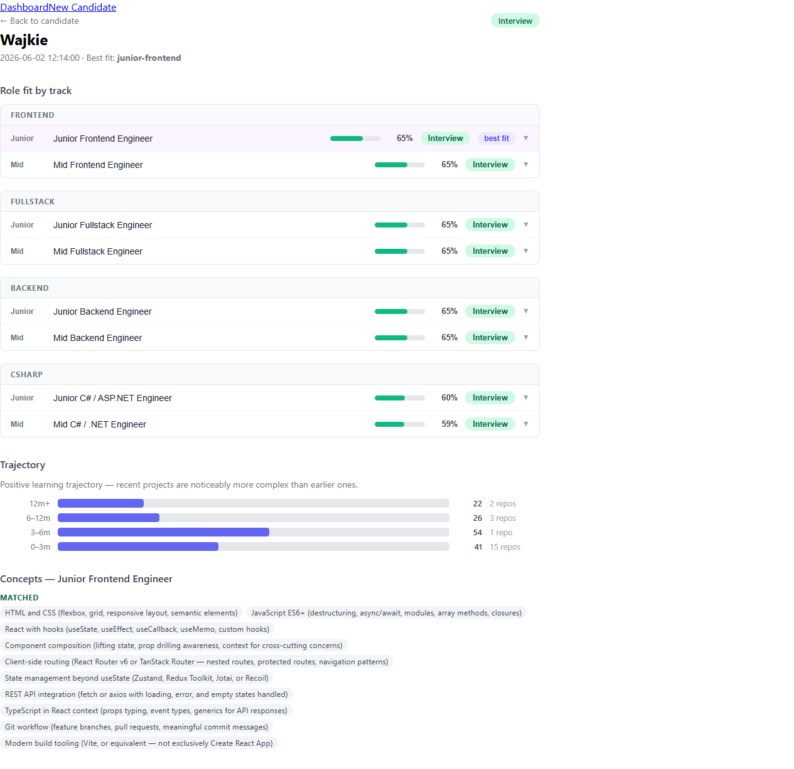
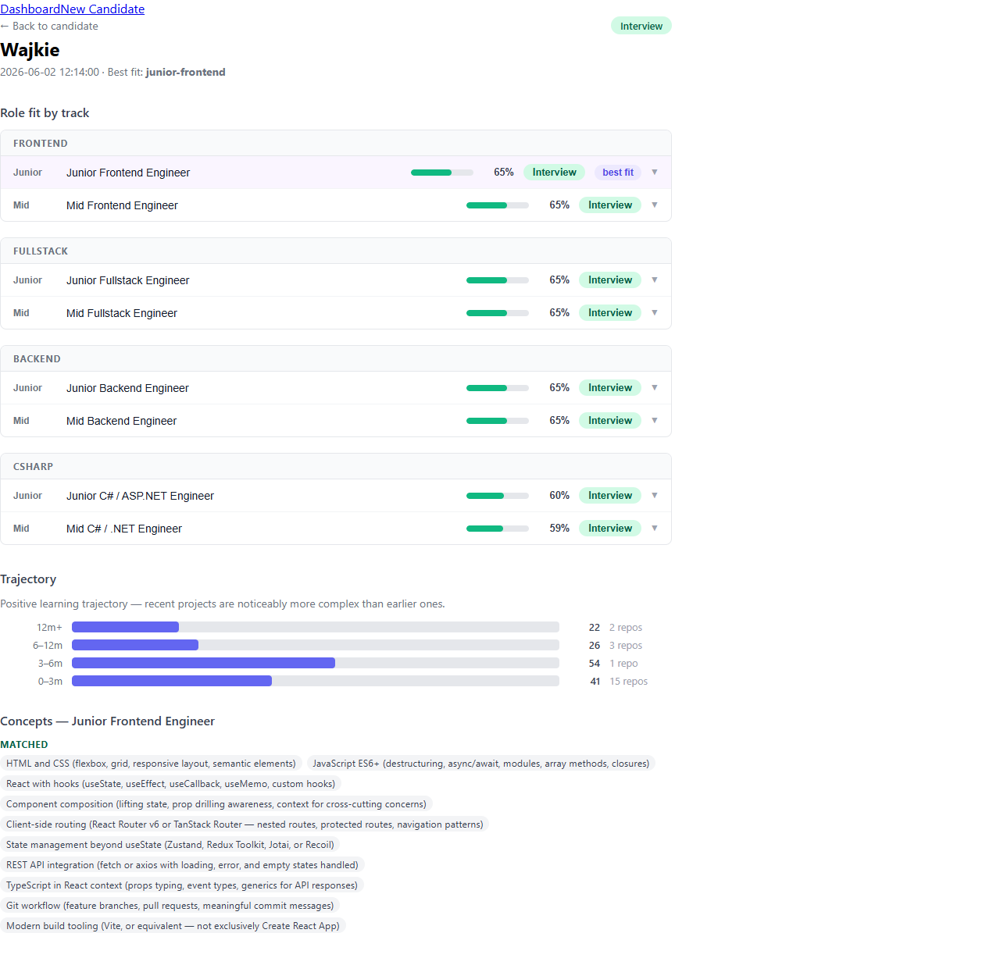
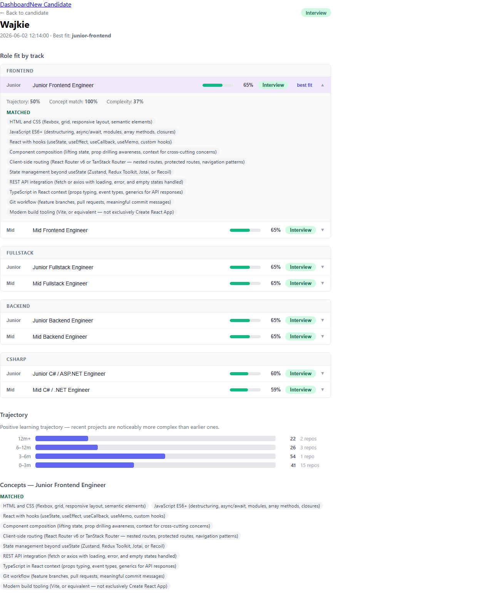
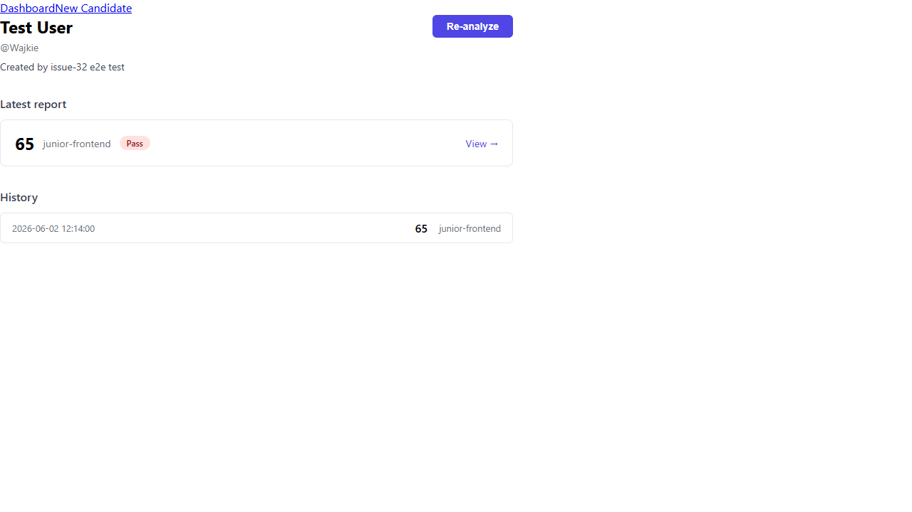
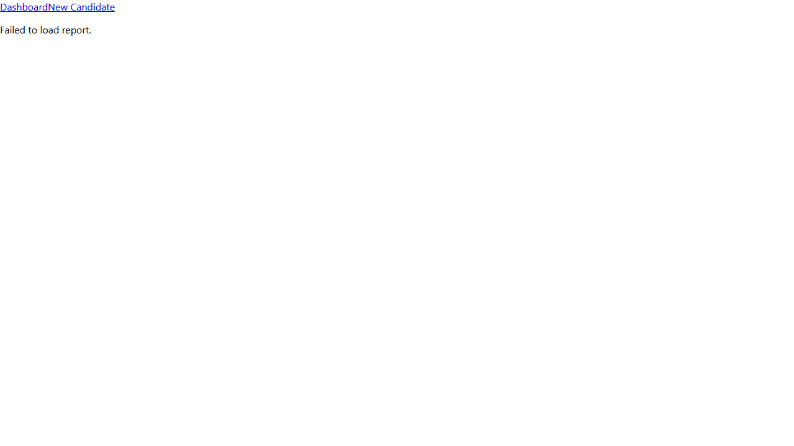

# Issue #32 — Report Detail Page

**Verdict:** PASS

**Run:** 2026-06-02T10:14:12.108Z

## Steps

### ✅ Full AllRolesResult is rendered across all sections

### ✅ Header: candidate username linked to GitHub

### ✅ Header: report date displayed in human-readable format

### ✅ Header: best_fit role shown

### ✅ Header: recommendation badge visible

### ✅ Track cards show all available role tiers with score bars and badges

### ✅ Best-fit role is visually highlighted

### ✅ Trajectory curve renders correctly

### ✅ Lighthouse panel renders if data is present; hidden if absent

### ✅ matched_concepts component handles both string[] and {concept, occurrences}[] without errors

### ✅ Concepts section — matched and missing for best-fit role

### ✅ Back link navigates to candidate page

### ✅ 🔍 Deep-link to report URL works without navigating from candidate

### ✅ 🔍 Non-existent report ID shows error state

