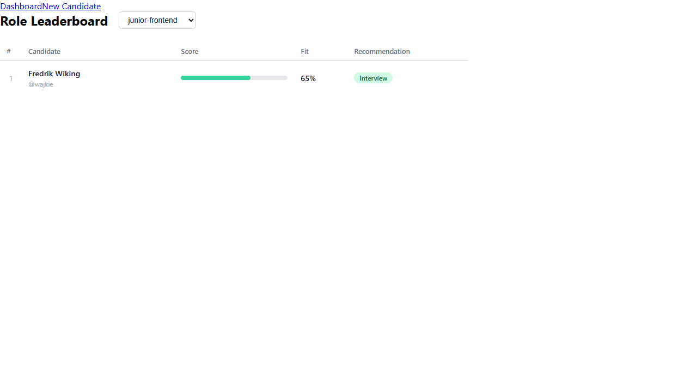
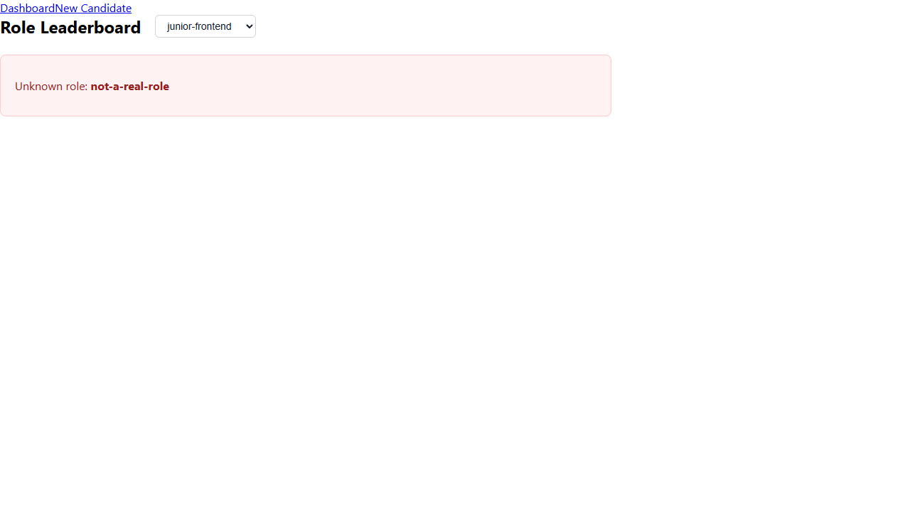
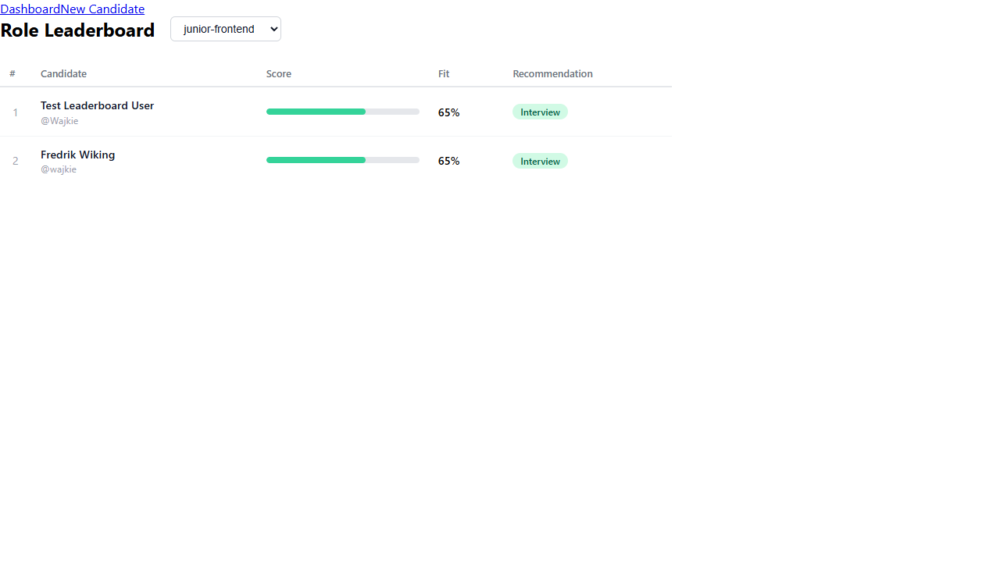
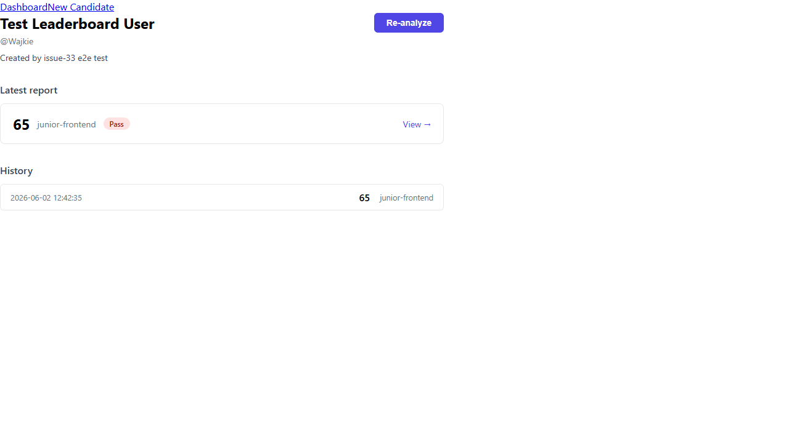
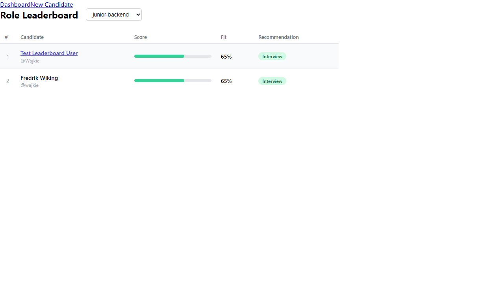

# Issue #33 — Role Leaderboard Page

**Verdict:** PASS

**Run:** 2026-06-02T10:42:37.588Z

## Steps

### ✅ Empty state shown when no candidates have been analyzed for a role

### ✅ Invalid role slug shows error state rather than crashing

### ✅ /roles/:role renders a ranked table sourced from GET /roles/:role/candidates

### ✅ Each row shows fit_score and recommendation badge

### ✅ Each row shows a score bar

### ✅ Username links to /candidates/:id

### ✅ Role selector updates the URL param and triggers a new fetch

### ✅ 🔍 Role selector is pre-selected to the current :role param

### ✅ 🔍 Direct deep-link to a role URL renders correctly

