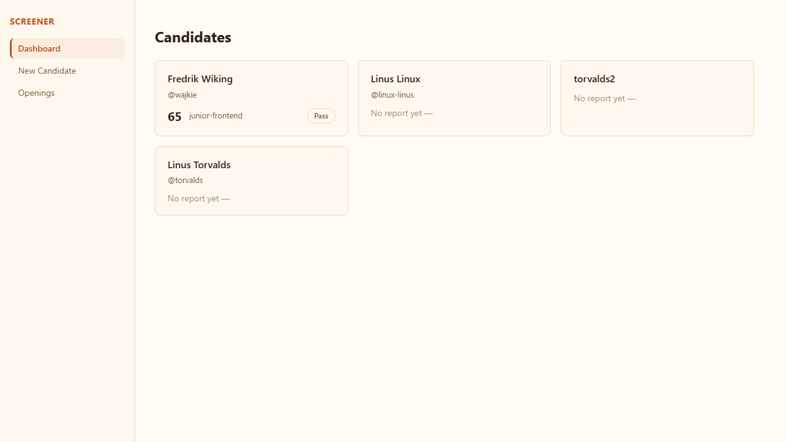
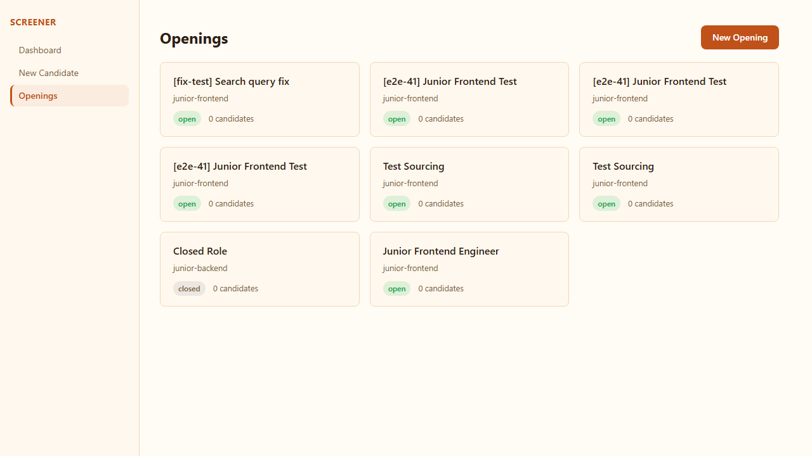
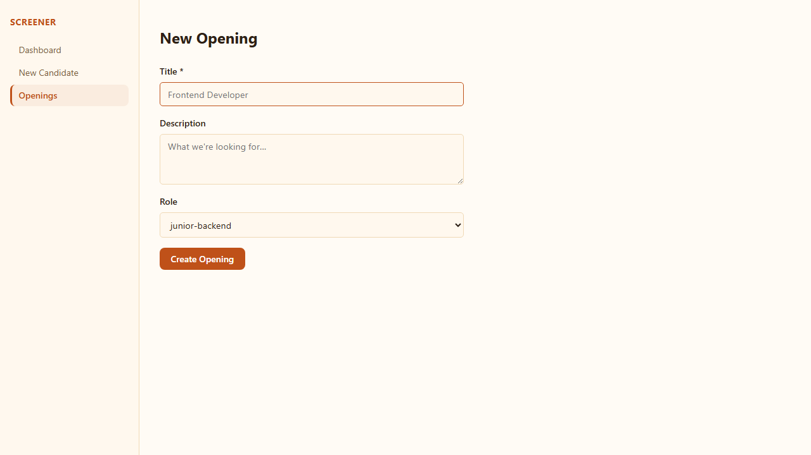
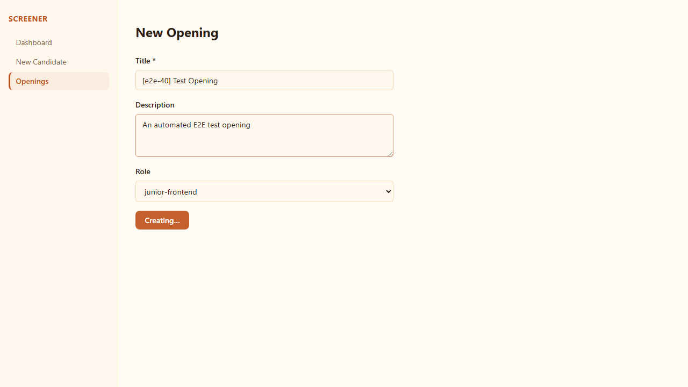
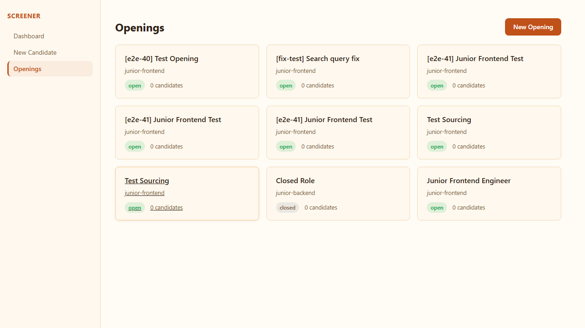
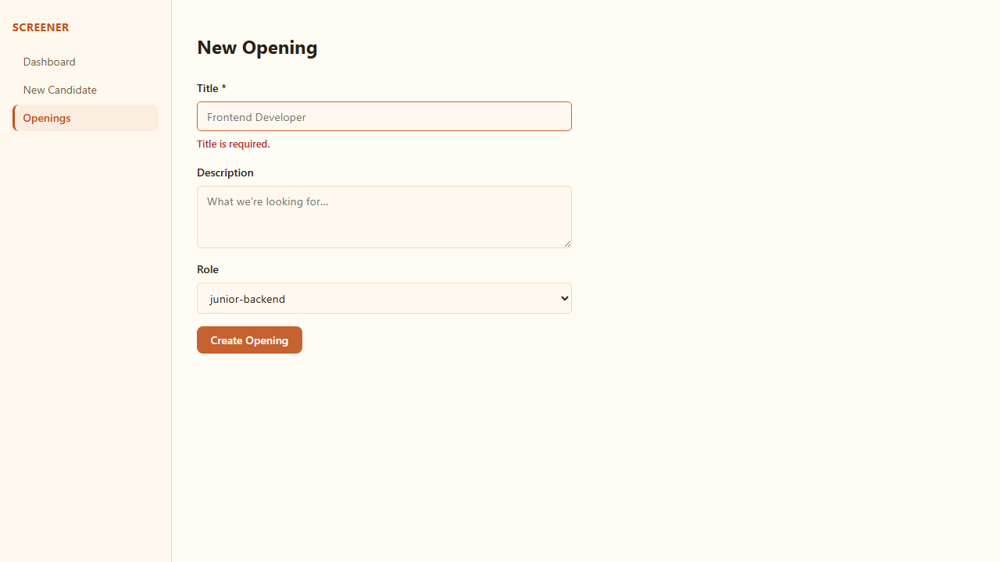

# Issue 40 — Openings list + create UI

**Verdict:** PASS

**Run:** 2026-06-02T15:20:47.923Z

## Steps

### ✅ "Openings" appears in the main nav

### ✅ /openings lists all openings fetched from the API

### ✅ Empty state shown when no openings exist

### ✅ /openings/new form renders with title, description, role dropdown

### ✅ /openings/new form submits and redirects to the new opening's detail page

### ✅ /openings lists the created opening with title, role, status, candidate count

### ✅ 🔍 /openings/new with empty title shows validation error (does not submit)

