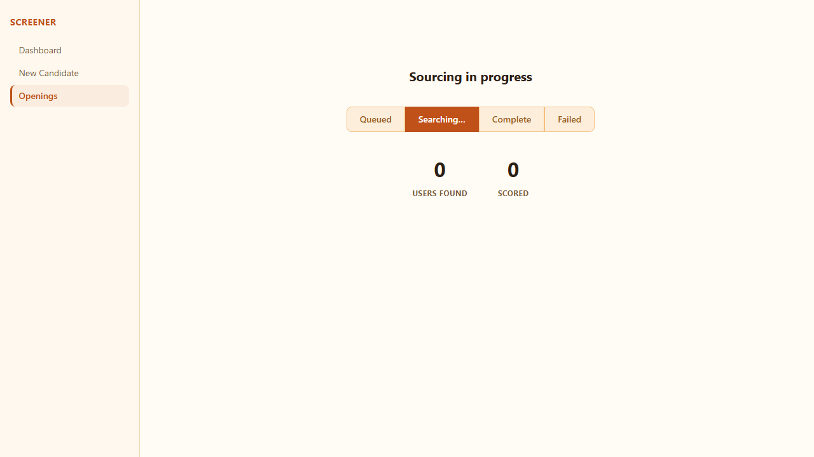
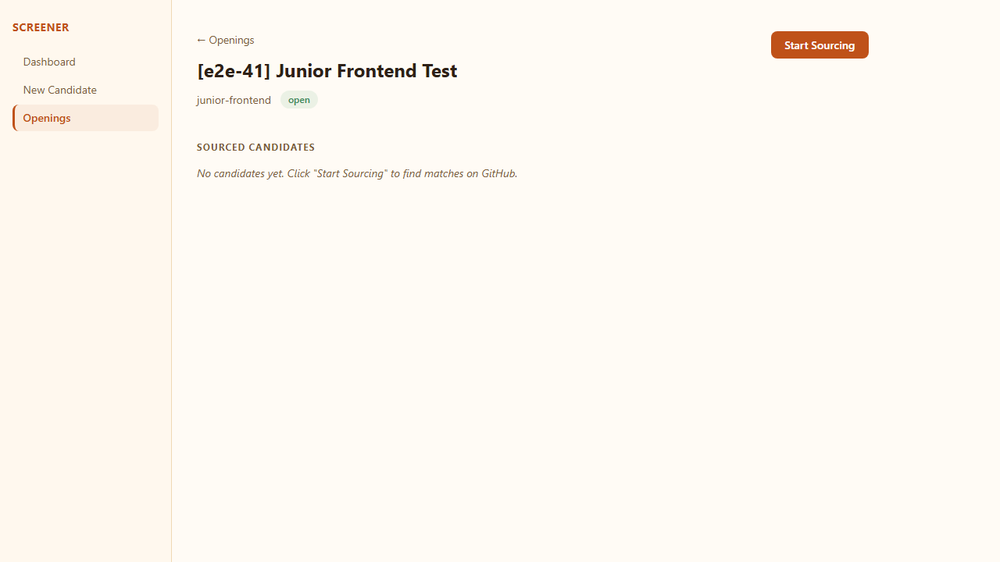
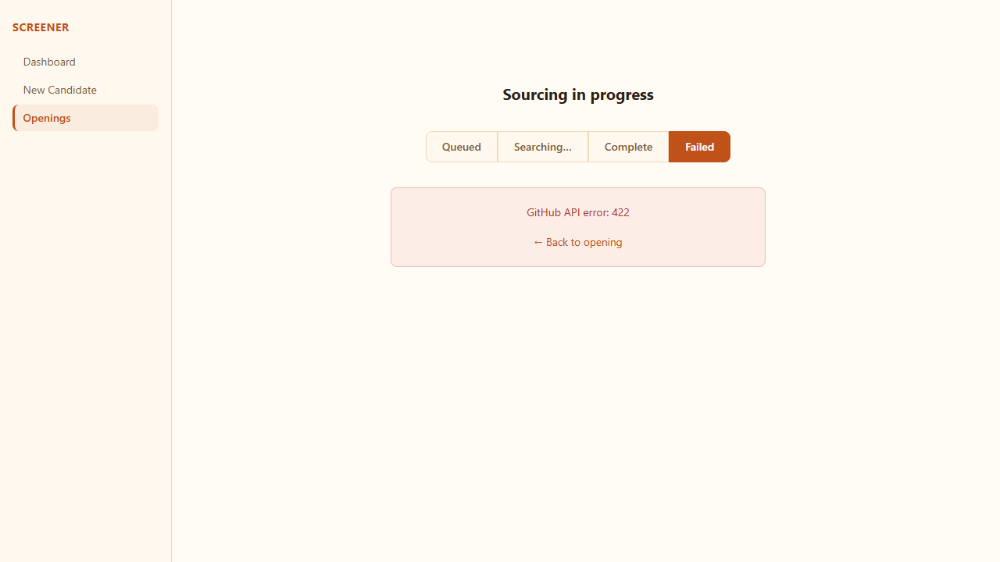

# Issue 41 — Opening detail + sourcing progress UI

**Verdict:** PASS

**Run:** 2026-06-02T13:56:45.172Z

## Steps

### ✅ /openings/:id renders the opening's details and ranked candidate table

### ✅ "Start Sourcing" button triggers sourcing and navigates to the progress page

### ✅ Progress page streams live updates via SSE until job reaches terminal status

### ✅ Navigating back to /openings/:id after sourcing shows the ranked results

### ✅ 🔍 Returning to a completed progress page shows terminal state (SSE onerror fallback works)

