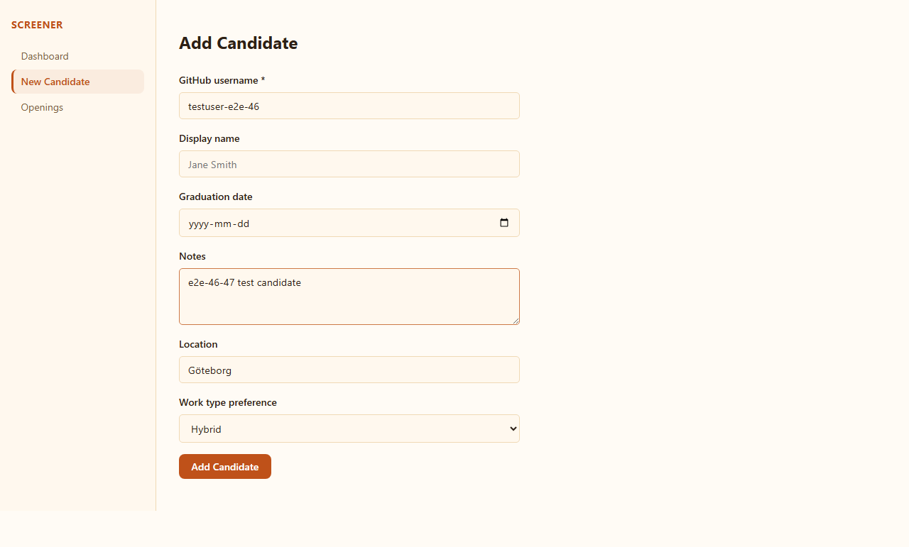
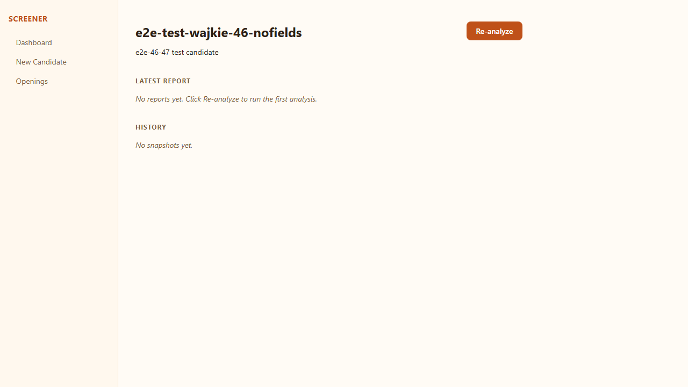
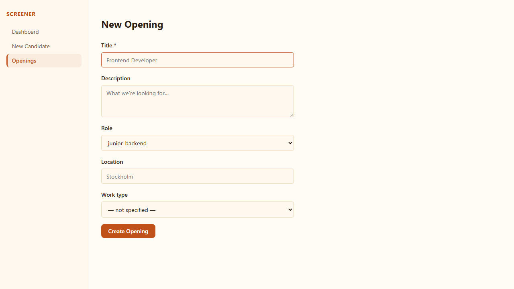
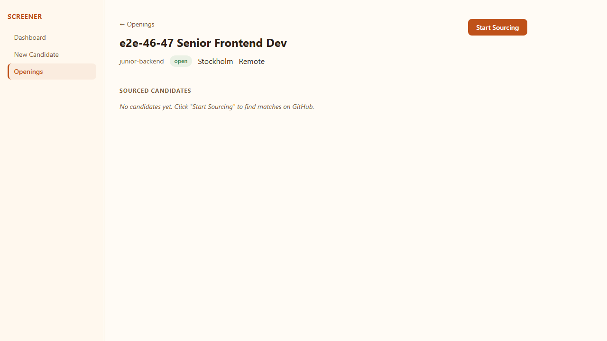
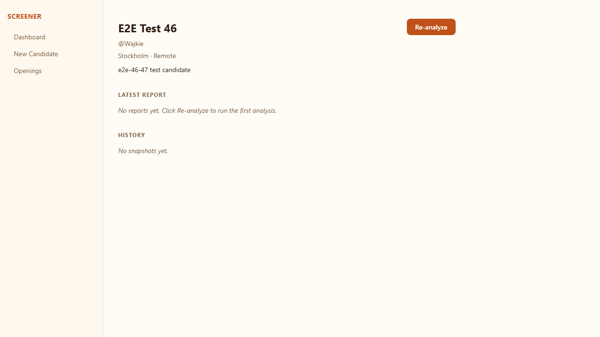
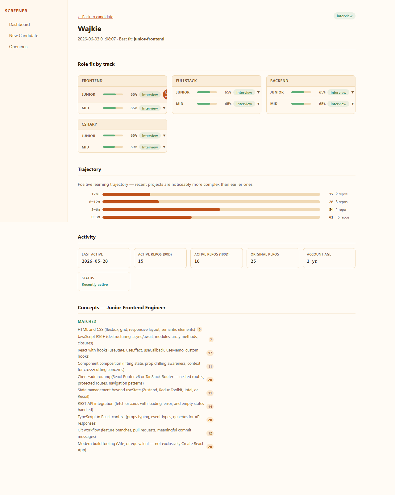

# Issue #46 + #47: location/work_type fields + activity panel

**Verdict:** PASS

**Run:** 2026-06-02T23:08:12.951Z

## Steps

### ✅ NewCandidate form submits location and work_type_preference when filled in

### ✅ NewCandidate form — submit and verify API stores location + work_type_preference

### ✅ CandidateDetail shows location and work_type_preference when present

### ✅ CandidateDetail hides gracefully when location/work_type_preference absent

### ✅ NewOpening form submits location and work_type

### ✅ OpeningDetail shows location and work_type in the header

### ✅ NewOpening form UI renders location + work_type fields

### ✅ E2E: create opening with location + work_type, verify both appear on detail page

### ✅ Activity panel renders on report detail when data.activity is present

### ✅ Activity panel is hidden when data.activity is undefined

### ✅ Analyze Wajkie candidate and verify activity panel on report

### ✅ All six activity signal fields are displayed

